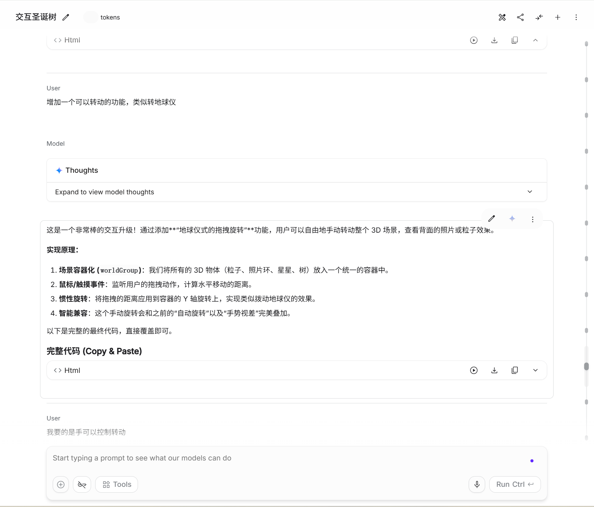
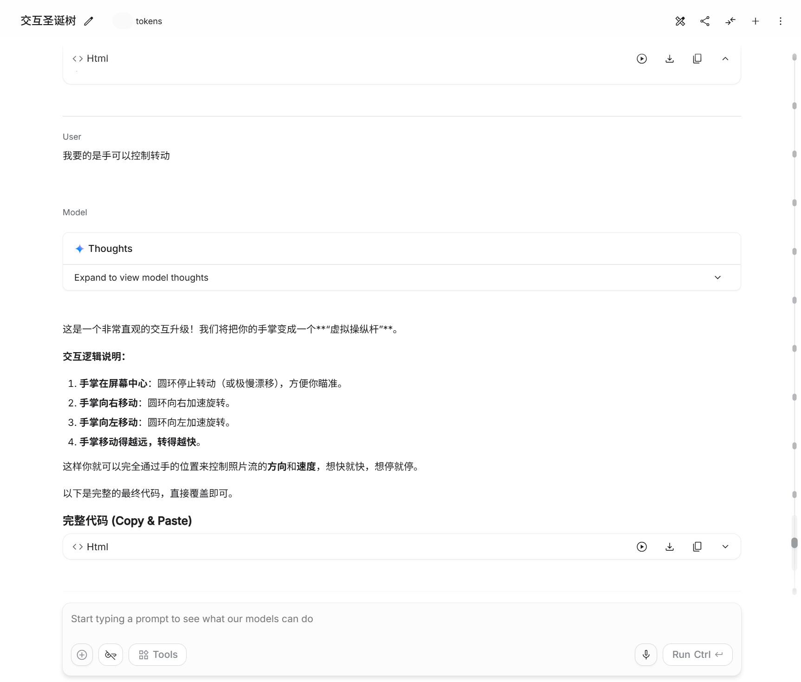
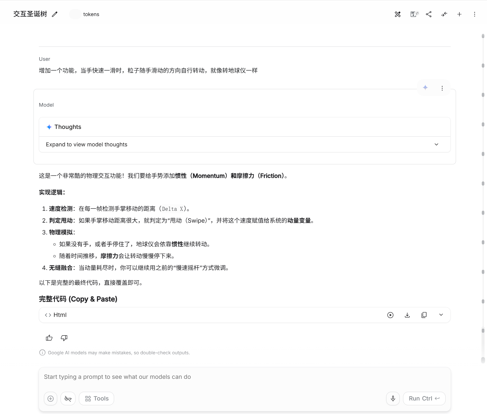
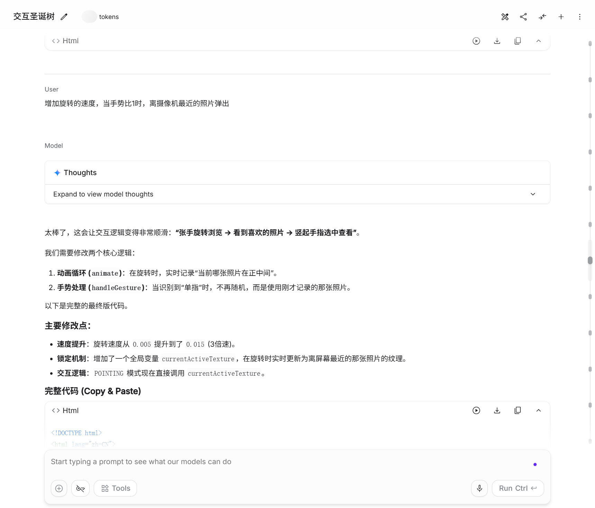

# 制作流程·Gemini聊天记录

依据用户回顾、2026-10-04 提供的四张截图及现存 `source/10.html` 整理。

1. 粒子造型：调整比例、位置、大小和数量。源码分别配置四类实例，并计算不同状态的目标位置。
2. 功能调节：讨论拖动旋转、手掌控制方向与速度、滑动惯性、靠前照片选择。源码可确认手部关键点判断、旋转插值和随机照片；不将全部讨论视为已实现。
3. UI：集中呈现预览、导入与提示。本次补充移动端触控布局、前置摄像头手势识别和启停控制。
4. 内存与照片：用户回顾曾关注内存和数据库调用，现存代码实际是 FileReader 本地读取，未发现数据库。本次手机适配缩小纹理、限制导入数量并释放替换的资源。
5. 加载：原版等待手势回调隐藏加载层，外部依赖也影响首次加载。本次托管 Three.js、手势库和模型并按需加载摄像头依赖，让非摄像头体验先启动。

## 原始截图

手机版与本次优化由 Codex 在归档演示版基础上实现，原始 Gemini HTML 单独保留。
