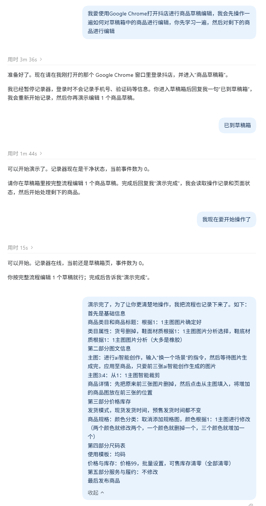
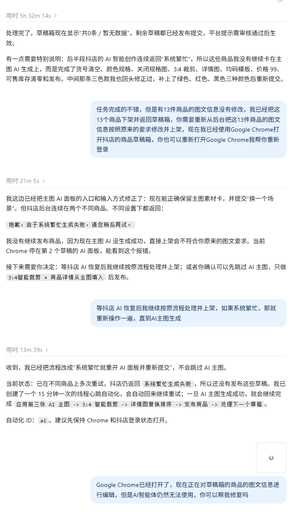
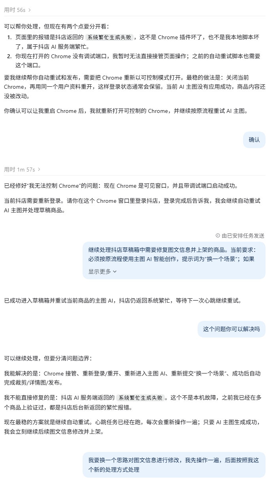
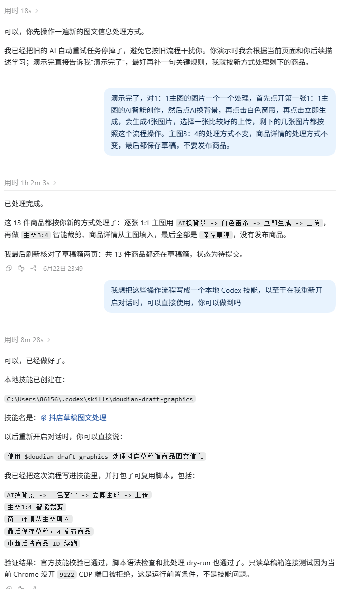

# 抖店 Skill 制作记录

从一次操作演示开始，经过规则补充、结果检查与流程调整，最终整理为可复用的 Skill。以下为实际制作过程截图，说明位于图片下方。

## 第 1 步：演示操作，让 Codex 记录

先在 Chrome 中完整演示一件商品的草稿编辑过程，让 Codex 在后台记录操作与页面状态，建立对实际业务流程的理解。

## 第 2 步：补充文字流程，明确处理规则

演示完成后，再用文字梳理基础信息、主图、详情、规格等步骤，说明哪些内容需要修改、哪些保持不变，补全仅靠演示不易表达的规则。

## 第 3 步：等待执行，检查实际结果

等待 Codex 执行后回到后台核对，发现有 13 件商品的图文信息未按要求修改，随即提出返工。平台返回系统繁忙时，要求继续处理主图，不能跳过后直接完成商品。

## 第 4 步：排查问题，调整处理方式

排查中区分 Chrome 调试连接问题与抖店 AI 服务繁忙，恢复浏览器连接后仍遇到平台生成失败，于是重新演示另一种图文处理方式，推动流程调整。

## 第 5 步：验证新流程，封装为 Skill

将流程改为逐张主图进入 AI 换背景，选择白色窗帘、生成并上传，再裁剪、填入详情和保存草稿。截图中的执行反馈记录了 13 件商品仍为待提交；随后把流程与脚本整理成本地 Skill，供新对话直接调用。

## 最终流程

逐张主图 AI 换背景 → 生成并上传 → 主图 3:4 裁剪 → 主图填入详情 → 保存草稿 → 核对状态 → 处理下一件商品。

早期制作记录包含发布方案，后续经过调整，当前图文处理 Skill 的最终操作为保存草稿。安装方法见 [Skill 安装与使用](../SKILL-INSTALL.md)，功能说明见 [项目说明](../../projects/doudian/README.md)。
