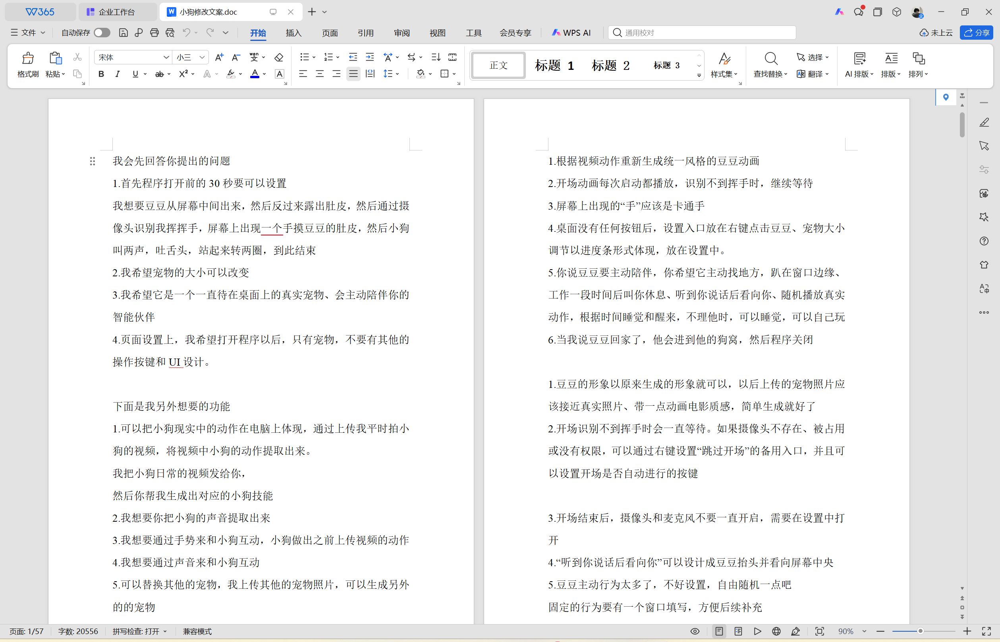
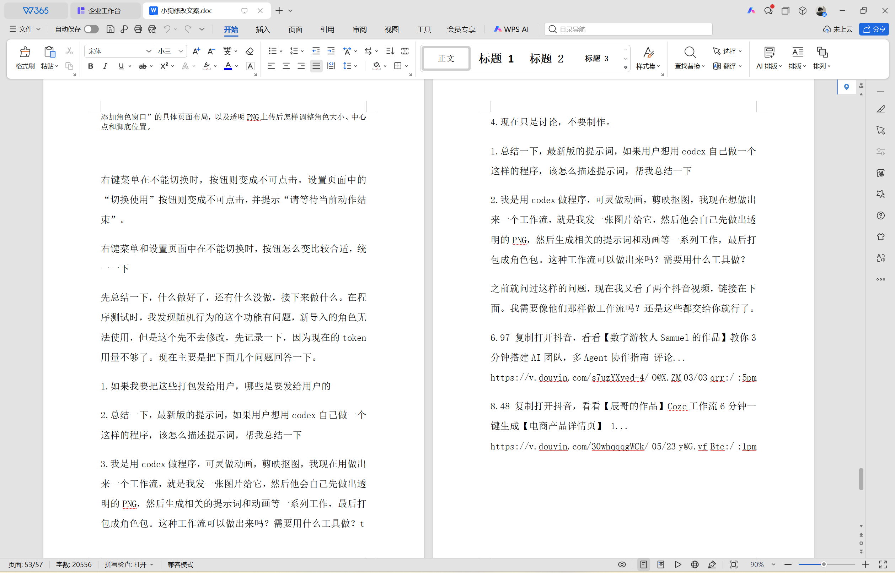
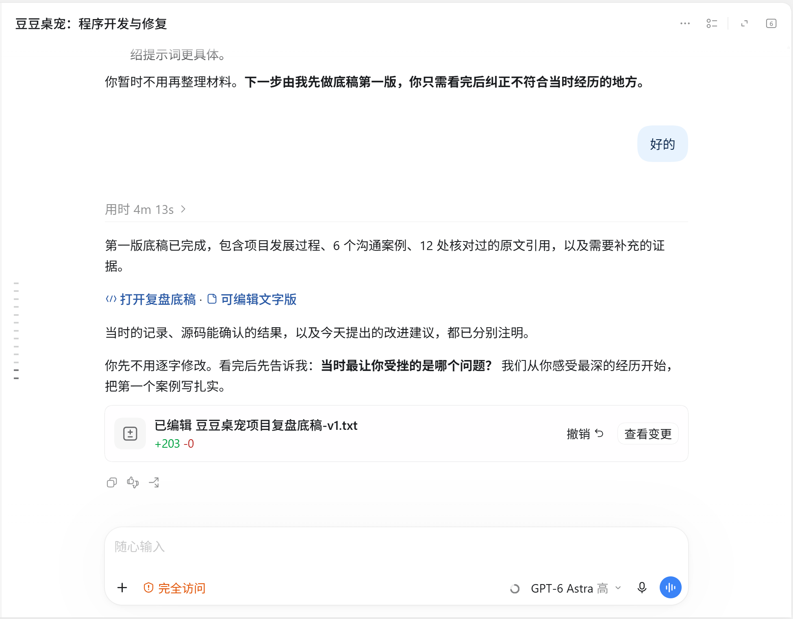
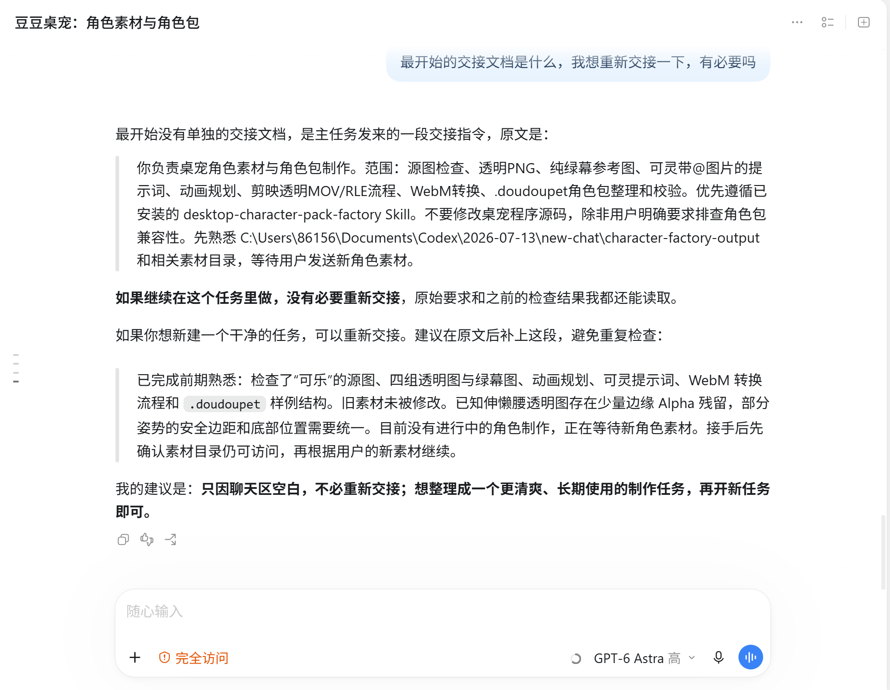
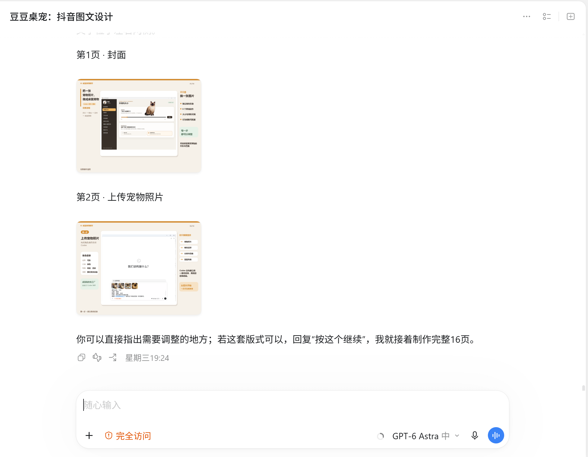
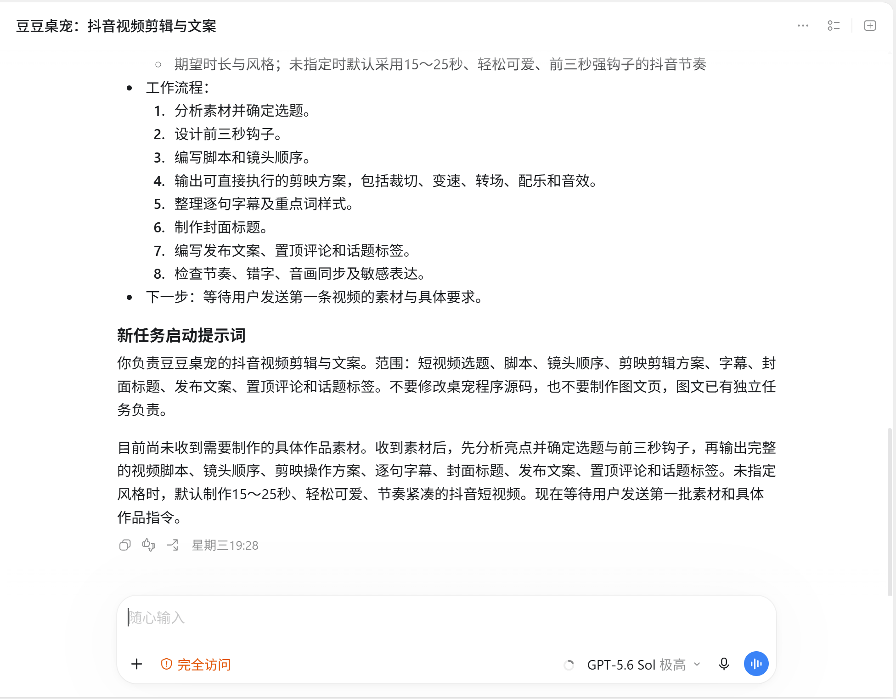

# AI桌面宠物制作记录

早期开发集中在一个较长的主任务中，后来拆分为程序开发、角色素材、作品图片和作品视频四个任务。原主任务记录已删除，目前保留《小狗修改文案.doc》（现存截图显示共 57 页）及四个子任务的截图。以下按“文档记录 → 子任务记录”的顺序展示，并结合现存材料整理制作中的问题与调整思路。

[下载原始文档](../../projects/doudou/records/小狗修改文案.doc)

## 文档记录 · 最初设想

记录开场动画、角色大小、桌面显示方式与互动设想，逐步把“让宠物陪伴在桌面上”细化为具体要求。

## 文档记录 · 迭代与流程整理

记录角色切换、素材整理和可复用工作流的讨论，也保留测试中遇到的问题与待完善事项。

## 程序开发与升级

保留程序维护任务中的复盘整理记录，结合现存文档与源码梳理开发过程、需求变化和问题反馈。

## 角色素材包生成

明确透明 PNG、绿幕参考、可灵提示词、MOV 抠图、WebM 转换与角色包整理的分工，并检查角色边缘、比例和底部对齐。

## 作品图片生成

先制作功能介绍图的封面和上传宠物照片页面，确认版式后再继续扩展整组图文。

## 作品视频生成

记录作品视频的选题、脚本、镜头顺序、剪映方案、字幕与封面规划；截图展示任务分工和制作方案。

## 制作中的问题与调整

根据现存文档与复盘底稿整理，以下为过程概括。原始文档包含不同阶段的设想、反馈与草稿，不能将每条历史需求视为当前已实现功能。

### 把陪伴感拆成操作规则

从开场、待机、休息到鼠标唤醒，逐步明确触发条件与返回状态；同时区分隐藏、关闭到通知区域和真正退出。

### 反复描述拖动异常

针对拖到屏幕边缘后反向移动、向右下方偏移或消失的问题，补充方向、连续操作和录屏反馈，让问题更容易复现和核对。

### 统一不同动作的大小和位置

发现待机与技能切换时角色大小、脚底位置不一致后，提出标准衔接姿势、暂停预览、缩放与位置校准，并调整参考图和提示词。

### 确定透明动画制作流程

在素材试做中确认绿幕参考图的重要性，逐步形成可灵生成、剪映抠图、透明 MOV 转 WebM 的流程，并单独制作转换工具。

### 收敛功能并扩展角色

先实现本地素材导入与播放，简化开场互动；再梳理角色分类、默认启动角色、切换与导入导出，让无互动流程可以由不同角色配置。

### 保留问题并拆分任务

文档保留了新角色随机行为、放大后按钮显示等问题反馈。后续将程序、角色素材、作品图片和作品视频拆成四个任务分别推进。

参考材料：《小狗修改文案.doc》；《豆豆桌宠项目复盘底稿-v1》（2026-09-30）；本次提供的制作截图。
