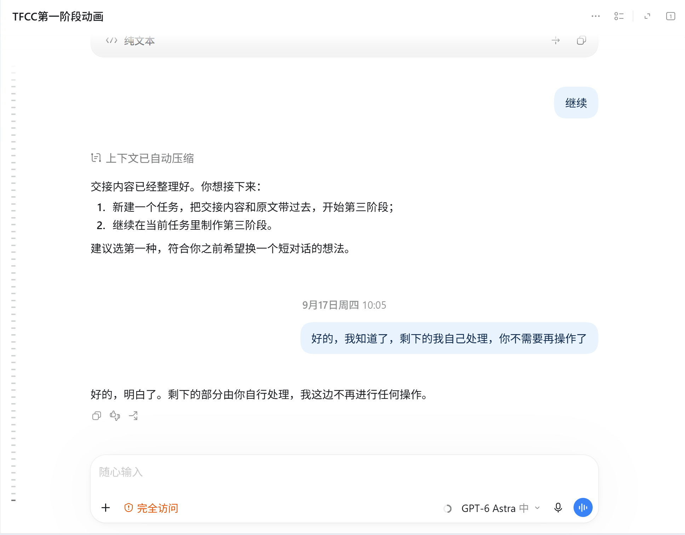
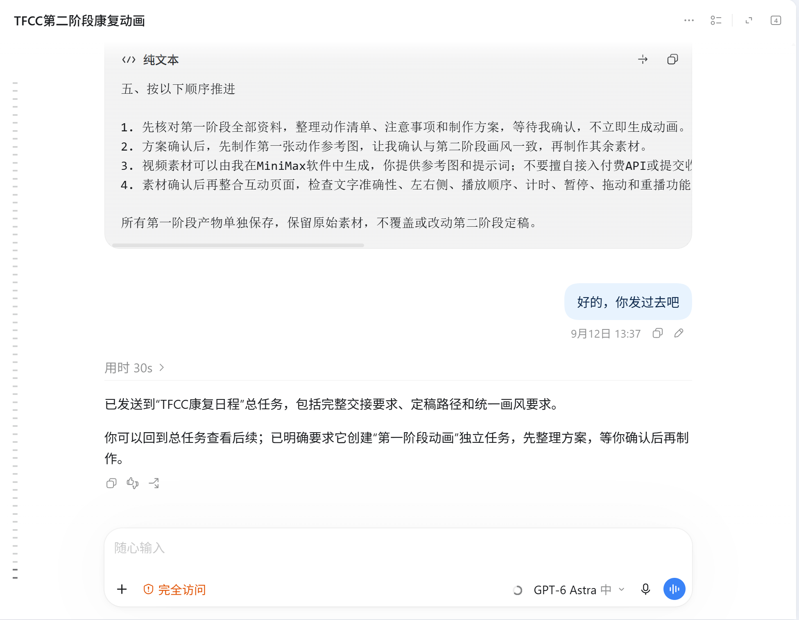
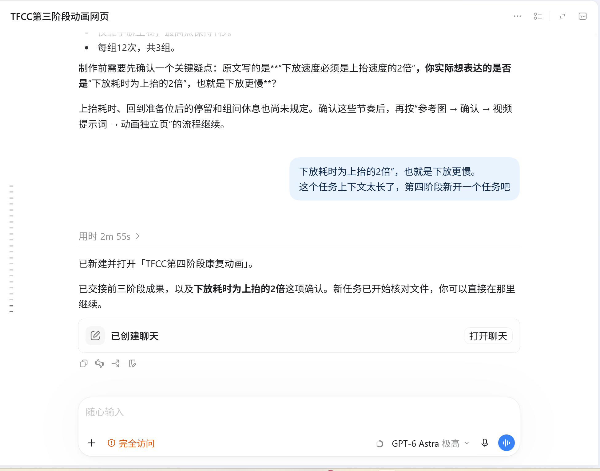
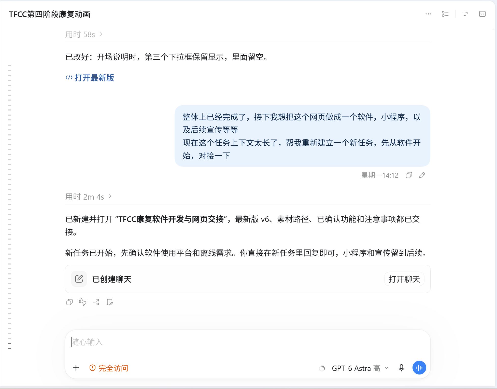
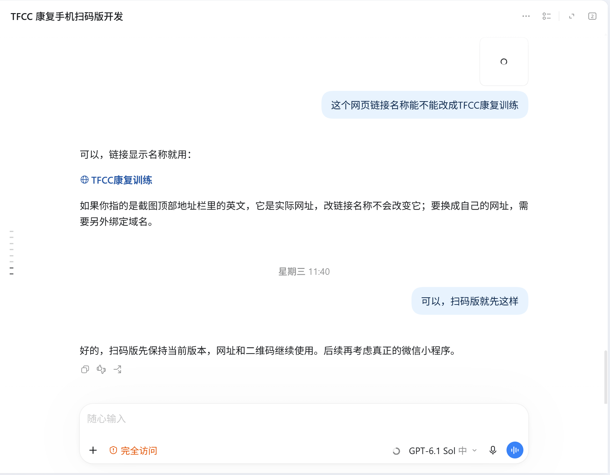

# 制作记录·codex聊天记录

## 第一阶段

第一阶段相关对话的收尾记录，保留阶段交接与后续安排。

## 第二阶段

在阶段制作中统一参考图与画风，明确提示词、视频素材和互动页面的制作顺序。

## 第三阶段

确认动作节奏的具体含义，并将前三阶段成果交接到第四阶段任务。

## 第四阶段

完善阶段说明的界面细节，完成网页后提出桌面软件与手机端的后续开发需求。

## TFCC手机扫码版开发

确定手机扫码打开网页的使用方式，调整链接显示名称并确认当前扫码版。
