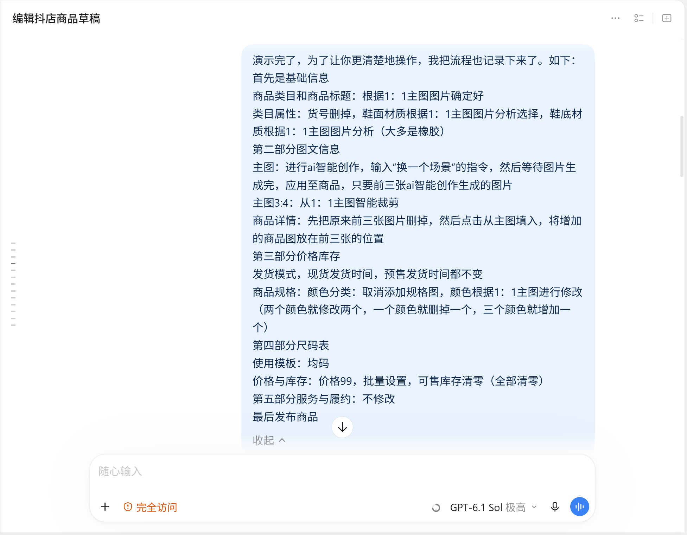
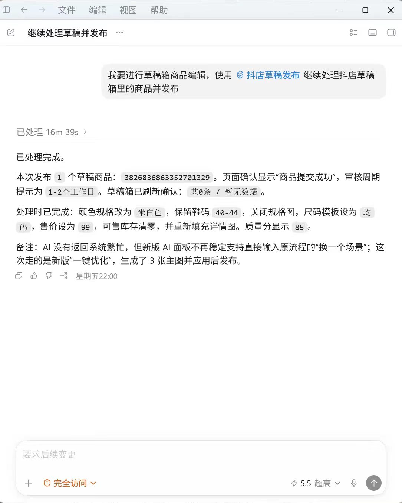

# 抖店商品编辑skill

在 Chrome 的抖店商品草稿箱中，自动整理商品图文，按提示词填写价格、库存与尺码表，保存草稿并继续处理下一件商品。


skill插件


skill插件



skill提示词



调用skill

## 功能介绍

1. **自动利用抖店 AI 生图。** 逐张打开 1:1 主图，进入 AI 换背景，选择白色窗帘，等待可用结果并上传到商品主图。生成中继续等待；生成失败或系统繁忙时按流程重试。
2. **自动填写商品图文信息。** 从 1:1 主图智能裁剪生成 3:4 图，更新商品详情前部图片并从主图填入，检查主图与详情的对应关系。
3. **自动填写价格库存与尺码表。** 按照提示词中的商品规格、价格、库存和尺码表要求，通过 Chrome 浏览器自动化在后台填写并核对；该流程直接连接浏览器操作，不使用 Computer Use 桌面模拟点击。
4. **自动保存并核对草稿。** 完成图文处理后保存草稿，再核对商品是否仍处于草稿箱 / 待提交状态。
5. **自动切换下一件商品。** 按草稿列表处理下一件未完成商品，记录已完成商品 ID 与执行日志；中断后可指定已完成 ID 接续处理。

截图保留当时的提示词与执行结果，其中包含发布操作；上述功能介绍以保存草稿为结束步骤，发布需另行明确指令。

## 安装与使用

- [下载 Skill 安装包](https://github.com/yuyuan23452-lang/ai-project-portfolio/releases/download/portfolio-2026-10-02/codex-skills.zip)
- [逐步安装说明](../../docs/SKILL-INSTALL.md)
- [查看 Skill 源码](../../skills/doudian-draft-graphics)

运行图文自动处理需 Codex、Windows PowerShell、Node.js、Chrome、`playwright-core`，以及使用者自己的抖店登录。首次使用可指定一件允许编辑的草稿，完成后检查图文和状态，再处理其余商品。

安装完成后，可向 Codex 发送：

```text
使用 $doudian-draft-graphics 处理抖店草稿箱商品图文信息。先检查运行环境，
按我指定的商品范围执行；逐张主图换背景、裁剪和填入详情，最后保存草稿。
```

## 技术组成

|文件或工具|作用|
|---|---|
|`SKILL.md`|触发条件、处理顺序、结果判断与恢复方式|
|`agents/openai.yaml`|显示名称、说明和默认提示词|
|Node.js / `playwright-core`|通过 Chrome CDP 连接浏览器，处理页面与商品图片|
|PowerShell 批处理脚本|循环定位商品、记录日志与已完成 ID|

页面更新、弹窗、素材额度和账户权限可能影响执行，遇到无法完成的步骤会记录结果，供检查与接续。图片生成由抖店平台提供。

## 制作记录

操作演示 → 文字规则 → 执行与检查 → 问题排查及流程调整 → 封装 Skill。

[查看四张原始制作截图及五个步骤说明](../../docs/evidence/doudian.md) · [版本与验证范围](../../docs/VERIFICATION.md)
