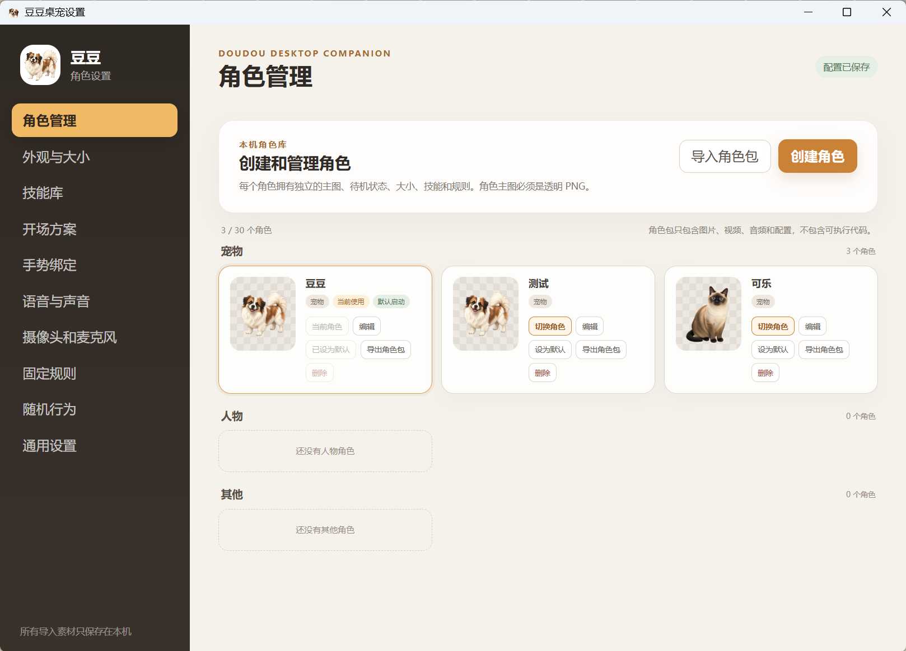
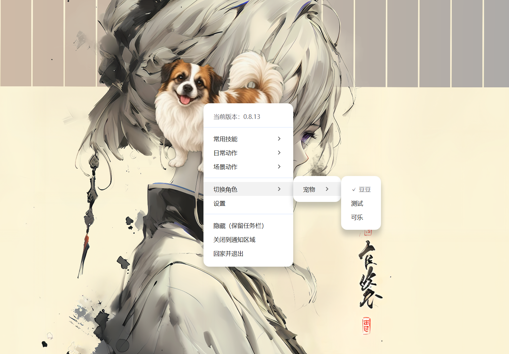
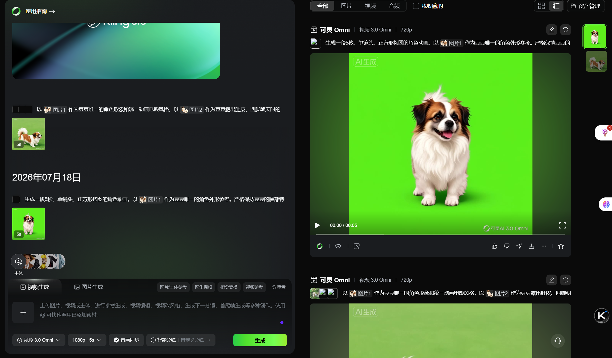
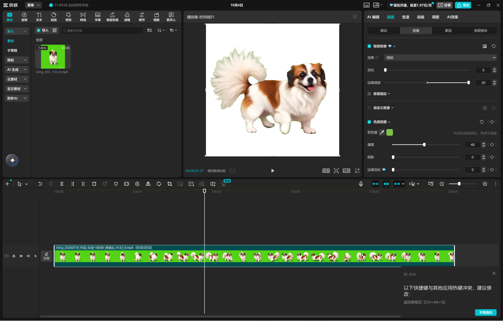
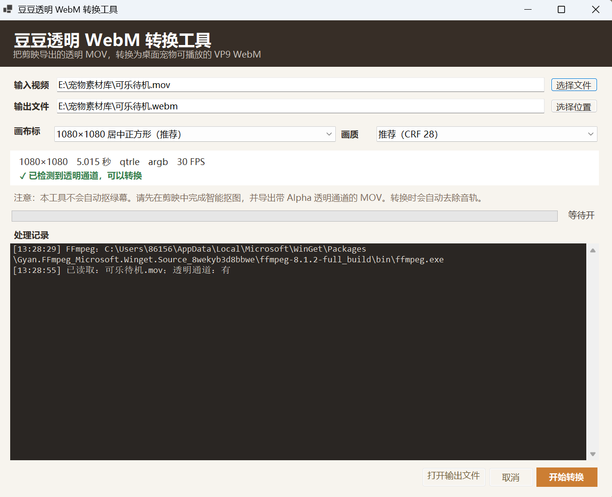

# AI桌面宠物

codex·可灵·剪映·webm·skill

## 项目介绍

1. 使用 Codex 辅助开发应用、配套程序和 Skill，可灵生成动作视频，剪映完成抠图与后期处理。
2. 打开应用后播放已设置的开场动画，结束后切换到当前角色的待机模式。
3. 在设定时间内没有互动时，角色进入休息模式；鼠标触碰后唤醒，并恢复待机。
4. 待机时可通过右键菜单互动，动作分为日常动作和场景动作；手势识别与语音识别作为后续扩展。
5. 日常动作使用带透明通道的 WebM 动画，让角色直接出现在桌面；场景动作使用包含背景的 MP4 视频。
6. 动作制作由 Codex 整理参考图和提示词，再用可灵生成视频，并在剪映中处理素材。
7. 透明动画制作流程：可灵生成绿幕视频 → 剪映抠图并导出带 Alpha 通道的 MOV → 用 Codex 辅助制作的 WebM 转换器转为透明 WebM。
8. 场景动画可直接使用处理好的 MP4 文件，导入应用后作为场景动作播放。
9. 角色包制作流程：调用角色包工厂 Skill 准备透明角色图、参考图和动画提示词；完成动画后，将素材集中到文件夹，交由 Codex 继续整理、校验并打包为可导入的角色包。
10. 支持宠物、人物和物品等角色的分类管理与切换；当前界面将物品归入“其他”分类。

## 下载与源码

- [下载 Windows 版](https://github.com/yuyuan23452-lang/ai-project-portfolio/releases/download/portfolio-2026-10-02/Doudou-Windows-0.8.13-x64.exe)
- [下载 WebM 转换器](https://github.com/yuyuan23452-lang/ai-project-portfolio/releases/download/portfolio-2026-10-02/Doudou-WebM-Converter.exe) · [使用说明](tools/WEBM-CONVERTER.md)
- [应用源码](source)
- [角色包工厂 Skill](../../skills/desktop-character-pack-factory) · [安装说明](../../docs/SKILL-INSTALL.md)
- [制作记录](../../docs/evidence/doudou.md) · [原始文档](records/小狗修改文案.doc)

## 运行与复现

当前应用归档版本为 0.8.13。进入 `source` 目录后运行 `pnpm install --frozen-lockfile`、`pnpm start`；打包使用 `pnpm run build:win`。

角色包工厂 Skill 提供角色图、参考图和提示词准备；后续视频制作、抠图、转换与最终角色包整理按项目流程分别完成。
