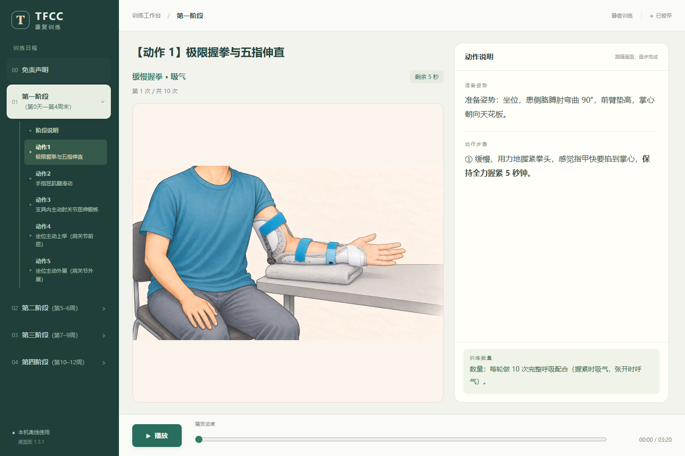
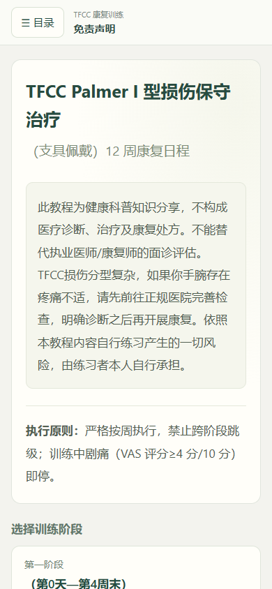
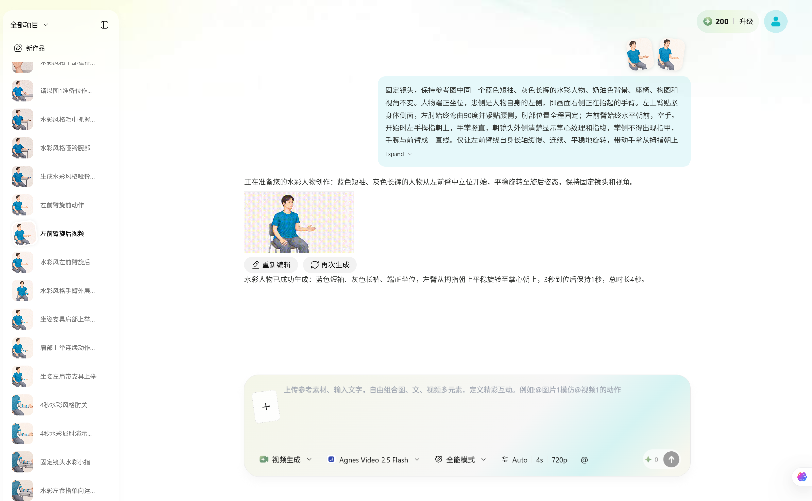
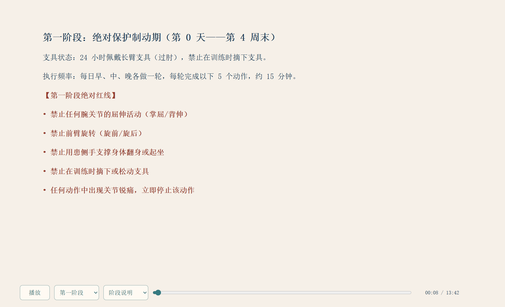

# TFCC康复训练应用

Windows 应用 · 手机网页 · Pavo

## 项目介绍

1. 先制定总任务，再按阶段拆分任务完成；每个阶段先制作说明，再制作动作动画。
2. 制作动作动画时，先用 Codex 生成提示词，再在 Pavo 上生成视频动画。
3. 各阶段保持格式统一，各个动作独立控制；进入后点击播放，切换离开再返回时从头开始。
4. 四个阶段完成后，先合成网页简单版，再以这个初始网页为基础制作桌面软件与手机版。
5. 将手机版部署到 Netlify/Qianwen，使用固定网址和二维码访问。实际测试中，原 chatgpt.site 地址访问受限，迁移到 Netlify/Qianwen 后可以打开。

## 体验与下载

- [网页版](https://luxinyuan-tfcc.netlify.app)
- [下载window版](https://github.com/yuyuan23452-lang/ai-project-portfolio/releases/download/portfolio-2026-10-02/TFCC-Windows-1.3.1-x64.exe)
- [查看源码与说明](https://github.com/yuyuan23452-lang/Lxy/tree/main/projects/03-TFCC康复训练应用)
- [手机版二维码](../../assets/screenshots/tfcc-qr.png)

## 源码结构与复现

- `desktop/main.cjs`：Electron 窗口与内容加载。
- `desktop/ui`、`desktop/content`：界面、播放行为、动作内容。
- `desktop/scripts`：内容整理、版式生成和检查。
- `web/dist`：H5 页面、样式和交互；这里作为已生成的可维护页面源文件保留。
- `web/build.cjs` 与 `worker.mjs`：打包静态页面与媒体读写服务代码。运行服务需配置 R2 兼容绑定 `BUCKET`；上传令牌由运行环境注入，不随仓库提供。

桌面版：从 Release 下载 `tfcc-media.zip`，**在仓库根目录解压**；旧版压缩包会生成 `projects/tfcc/desktop/content/`，请将其中的视频复制到 `projects/03-TFCC康复训练应用/desktop/content/`。也可运行 `python scripts/prepare-tfcc-web.py`，自动将旧目录的视频补充到新目录并准备 H5 媒体。进入 `desktop` 后运行 `pnpm install --frozen-lockfile`，再运行 `pnpm start`；`pnpm run dist` 可生成 Windows 包。`prepare:content` 是历史素材整理脚本，引用原工作目录，不是当前干净检出的必需步骤；不要运行它覆盖已归档内容。

本地 H5：运行仓库的 `python scripts/prepare-tfcc-web.py`，将桌面媒体复制到 H5 目录，再在仓库根目录运行 `python -m http.server 8080`，访问 `/projects/03-TFCC康复训练应用/web/dist/`。部署服务代码前仍需自行准备媒体与运行环境；仓库不含历史上传状态和部署凭据。

[制作记录·codex聊天记录](../../docs/evidence/tfcc.md)
