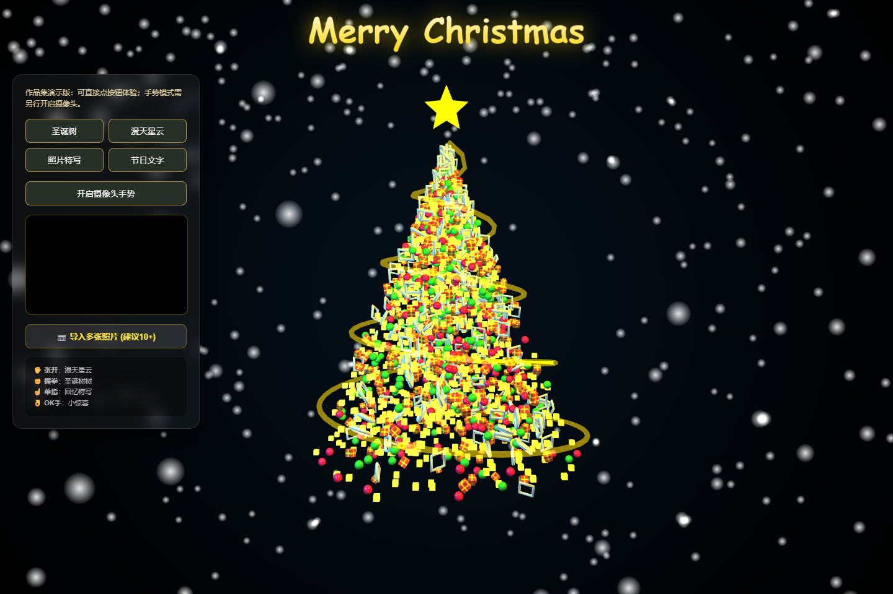
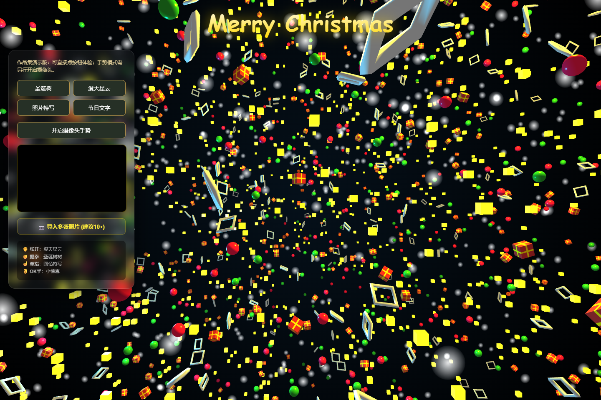
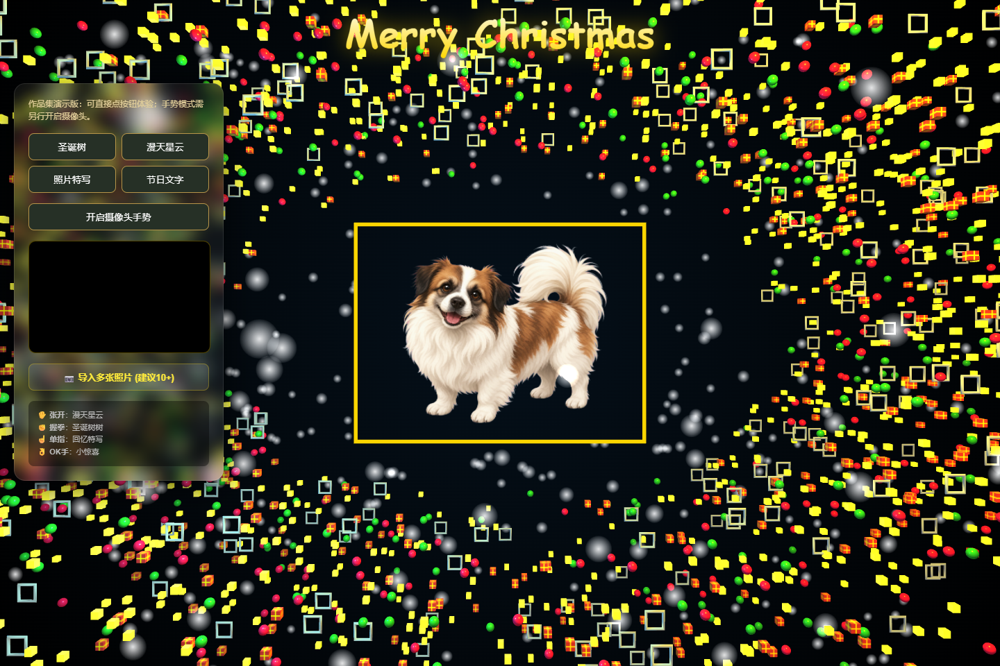

# 圣诞树交互 HTML

最早的 AI 辅助制作项目。根据本人回顾：2025 年 12 月参考同类短视频效果，以 Gemini 辅助从空白页面制作，约三天完成；2025-12-15 开始分享。

## 功能

|交互|效果|实现|
|---|---|---|
|握拳|粒子聚合为圣诞树|更新粒子目标位置并插值过渡|
|张开手掌|粒子展开为星云，照片形成展示云|Three.js 场景与图片纹理|
|伸出单指|选取一张已导入照片特写，带随机倾斜|本地文件读取与纹理显示|
|OK 手势|节日文字效果|Canvas 文本纹理与场景切换|
|手掌位置变化|影响场景旋转|MediaPipe 手部关键点位置映射|
|多图导入|选择本地多张照片，供照片云/特写使用|FileReader，不需要自建图片上传后台|

原代码包含 1100 个方块、600 个球体、300 个框和 400 个礼物实例；使用 Three.js r128 与 MediaPipe Hands。通过关键点距离规则判断手势，没有训练自有识别模型。

## 电脑版与手机版

- [网页电脑版](https://luxinyuan-ai-projects.netlify.app/projects/christmas-tree/demo/?mode=gesture)：摄像头手势和页面按钮包含在同一页面中。
- [手机版](https://luxinyuan-ai-projects.netlify.app/projects/christmas-tree/demo/?mode=mobile)：扫码打开，点击“开启摄像头手势”使用前置摄像头；也支持底部按钮、拖动旋转及手机相册导入。

默认不展示示例照片，也不自动申请摄像头权限。照片特写需自行导入图片。摄像头启用后可主动关闭；离开页面或切到后台时停止拍摄。权限拒绝时显示可重试提示。手机手势检测使用轻量模型、单手识别及串行处理，避免同时堆积识别请求。

手机入口使用 800 个造型粒子、250 个雪花粒子，限制像素密度，导入最多 12 张照片并缩小到最长边 1024 像素。替换照片时释放旧纹理与展示对象。照片和摄像头画面在浏览器本地处理，不上传服务器、不调用数据库；刷新后需重新导入照片。

Three.js r128（MIT）与 MediaPipe Hands 0.4.1675469240（Apache-2.0）随站点托管；手势库和模型按需加载。摄像头需要 HTTPS、浏览器权限和可用设备；手机内置浏览器若不提供摄像头 API，请在系统浏览器中打开。

`source/10.html` 保留原始文件；本次适配均在 `demo/index.html`。旧的 `?mode=buttons` 链接继续可用，但作品集不再单独列出。

## 制作流程与证据

见 [Gemini 制作记录](../../docs/evidence/christmas-tree.md)。截图记录了旋转方向、滑动惯性、照片选择等需求讨论；讨论不等于每个方案都已进入现存代码。现存代码仍采用随机照片。

本次通过 DOM 与真实 Three.js 场景对象检查入口初始化、四种状态切换、拖动事件、尺寸变化、摄像头启停与拒绝授权后的恢复；此验证不包含实际 GPU 渲染或真实摄像头识别，手机实机体验仍需测试。
