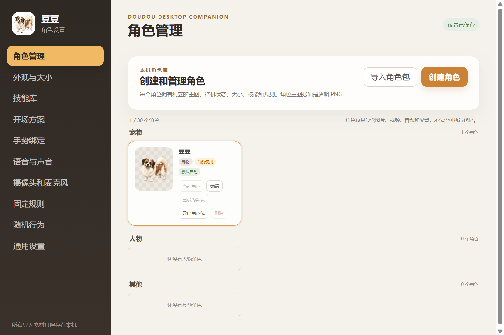
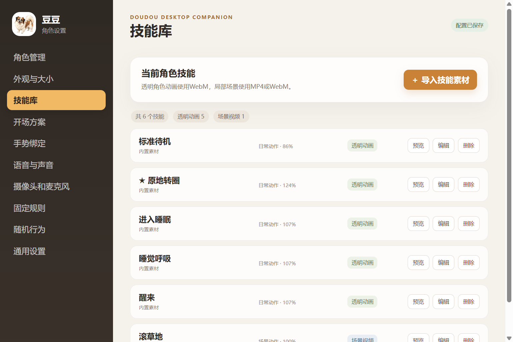
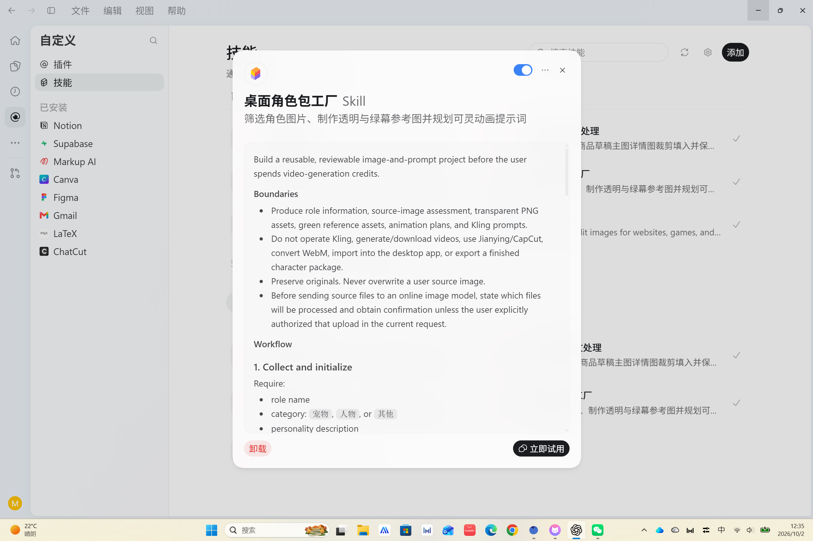

# 豆豆桌宠与桌面角色包工厂

Windows 桌面角色应用，当前归档版本 0.8.13。将角色、技能素材、待机/睡眠和开场播放配置化，配套 Skill 整理新角色前期素材。

## 桌宠功能

|模块|实现内容|
|---|---|
|桌面角色|透明窗口、角色拖动、缩放、隐藏与托盘生命周期|
|角色管理|宠物/人物/其他分类，角色创建、选择、默认角色与删除；各角色独立配置|
|角色包|角色包导入导出及文件结构检查，方便迁移角色素材|
|技能库|本地 WebM/MP4 导入、预览、分类、命名、静音与播放；透明技能和场景技能分开处理|
|待机与睡眠|静态图/动画待机，无互动后睡眠与唤醒；随机行为可开关和配置|
|开场方案|多片段管理、顺序与缩放设置，播放后返回角色待机状态|

原目录早期 README 的 0.8.5 功能清单存在过期描述，本归档按 0.8.13 的源码与功能页面重新整理。摄像头识别表情、语音对话等早期设想不列为当前已交付功能。

## 配套：桌面角色包工厂 Skill

放在此项目下作为素材准备模块，也在仓库 `skills` 中提供可安装目录。用于复用角色素材准备流程。

1. 收集角色名称、分类、性格和原始参考图。
2. 检查图片尺寸/透明信息并筛选参考图，保留原文件。
3. 规划或生成统一风格的透明 PNG 标准图。
4. 用脚本生成纯绿色参考底图，保持角色比例和位置。
5. 整理动作规划、参考图使用方式与可灵提示词。

该 Skill 负责第一阶段素材与提示词，不自动完成视频生成、抠像、WebM 转换或最终角色包导入。图像生成依赖相应工具，普通脚本不会自动调用付费生成服务。

## 试用与复现

- [下载 Windows 0.8.13](https://github.com/yuyuan23452-lang/ai-project-portfolio/releases/tag/portfolio-2026-10-02)，运行后从托盘或角色右键进入设置。
- 源码位于 `source`；`pnpm install --frozen-lockfile`、`pnpm start`。
- 测试：`pnpm run test:characters`；语法检查：`pnpm check`；打包：`pnpm run build:win`。
- [角色包工厂源码](../../skills/desktop-character-pack-factory) / [Skill 安装方法](../../docs/SKILL-INSTALL.md)。

## 开发说明

本人确定桌宠使用场景和交互预期、选择与检查素材、反馈界面和动作效果，借助 Codex 逐步实现与封装应用。

代码测试只能覆盖所测逻辑；Windows 透明窗口、媒体播放和完整系统兼容性仍需要实际运行观察。本次检查范围见 [验证记录](../../docs/VERIFICATION.md)。
